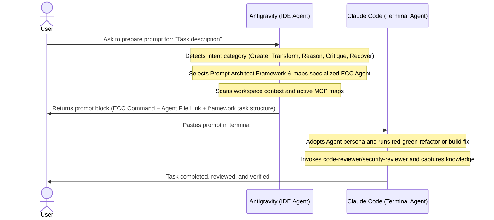

# /antigravity-guide

Use this guide to coordinate tasks between the Antigravity IDE agent (acting as the Architect/Planner) and the Claude Code terminal agent (acting as the Executor).

## Usage

```text
/antigravity-guide
/antigravity-guide prepare: <description of task>
/antigravity-guide status
```

## Operating Rules

1.  **Read-Only Preparation**: Antigravity must perform all initial analysis (file mapping, dependency check, rule extraction) in read-only mode.
2.  **Explicit Context Linking**: All generated prompts must explicitly anchor files using `file:///` URLs.
3.  **Command & Framework Translation**: Translate the user's task description into a specific ECC command line (e.g., `/plan`, `/tdd-workflow`, `/build-fix`) AND structure the description utilizing a selected **Prompt Architect framework** (like TIDD-EC, BAB, or RISEN) based on the task intent.
4.  **ECC Agent Integration**: Link the instruction file of the relevant specialized ECC agent (e.g., [tdd-guide.md](file:///d:/CLAUDE-PROJECT/website/.agent/skills/tdd-guide.md) or [build-error-resolver.md](file:///d:/CLAUDE-PROJECT/website/.agent/skills/build-error-resolver.md)) in the prompt's context to instruct the terminal agent to adopt that persona.
5.  **Validation & Review**: Direct the terminal agent to perform post-implementation reviews using quality gate agents (e.g. `code-reviewer.md` and `security-reviewer.md`).
6.  **No Action Duplication**: Antigravity must never attempt to compile, run tests, or modify source code during the preparation phase.
7.  **MCP Integration**: Direct Claude Code to use its connected MCP servers (`playwright` for browser tests, `context7` for Next.js/Tailwind/Prisma docs, `sequential-thinking` for systemic logic, and `memory` for entity persistence).
8.  **Knowledge Capture Policy**: Remind the terminal agent to save session-specific debug info to memory (via the `memory` MCP server) and project-wide design patterns to the docs structure.

## Environment Information

*   **Claude Code version**: `2.1.138 (Native win32-x64)`
*   **Active MCP servers**:
    *   `sequential-thinking` (Connected)
    *   `playwright` (Connected)
    *   `context7` (Connected)
    *   `exa` (Connected)
    *   `github` (Connected)
    *   `memory` (Connected)

## The Cooperative Workflow



### Step 1: Request Prompt Preparation
Ask Antigravity in the IDE chat to prepare a prompt for your task.
For example:
> "Prepare a prompt for implementing the RFQ fallback button."

### Step 2: Workspace, Intent, and Agent Exploration
Antigravity scans the repository and prompt context to identify:
*   **Target Framework**: Analyzes the intent to map to the best prompt engineering framework (e.g., TIDD-EC, BAB).
*   **Specialized Agent Persona**: Identifies which ECC Agent should execute this (e.g. `tdd-guide.md` for new logic).
*   **Relevant Code**: Locates source files and test files.
*   **Active MCP mappings**: Detects which tools/MCP servers are needed.

### Step 3: Copy and Paste
Antigravity outputs a formatted block. Copy the prompt block and paste it directly into your Claude Code terminal.

### Step 4: Execution, Review, and Verification
Claude Code receives the highly structured prompt, adopts the linked specialized agent persona, carries out the changes safely, runs reviews with validation agents, and captures knowledge in the right place before closing.

## Response Patterns

### No Arguments
Provide a quick menu explaining the division of labor, followed by instructions on how to use `prepare: <task>`.

### For `prepare: <task>`
1.  **Analyze & Categorize**: Classify the request intent, choose a prompt framework from `prompt-architect`, and select the target specialized ECC agent.
2.  **Verify target files**: Ensure paths exist.
3.  **Draft prompt**: Output a markdown code block starting with the correct ECC command (e.g., `/tdd-workflow`), linking the target specialized agent file, and formatted using the selected framework's template.
4.  **Confirm**: Remind the user to paste this block into the Claude Code terminal.
5.  **MCP directives**: Include clear guidelines for MCP server invocation.